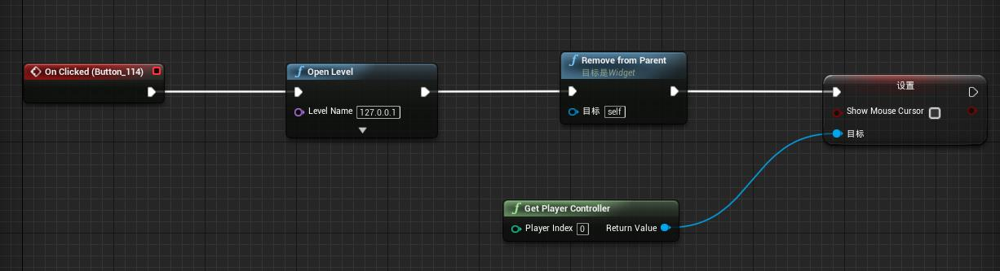
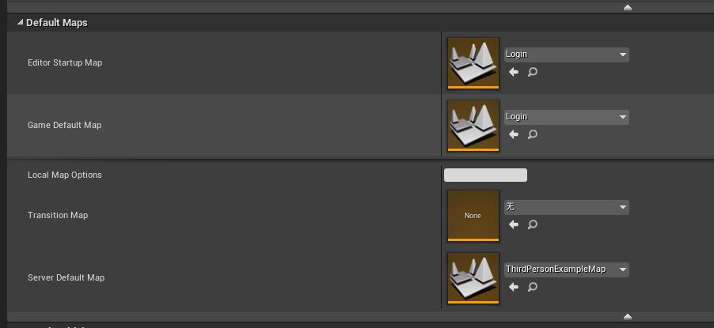
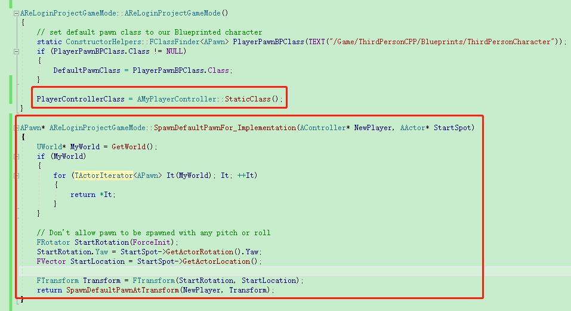

# 掉线重连机制实现

本文通过一个简单的例子介绍项目中断线重连的实现方式

## 原理

玩家在掉线后，虚幻默认逻辑是删除玩家的PlayerController和对应的Pawn，玩家再次登录的话就创建新的PlayerController和Pawn。 掉线重连就要实现掉线的时候不删除Pawn，重连进来的时候创建PlayerController（默认逻辑）但不创建Pawn,在世界内找到Pawn绑定即可。

## 实现

1. 我们先创建一个第三人称的工程，命名为ReloginProject,创建一个命名为Login的关卡供登录使用，Login关卡蓝图BeginPlay会创建Login的Widget，Widget蓝图内容如下:

2. 编辑ThirdPersonExampleMap地图，将地图中种的Pawn删除掉。项目配置如下:

3. 创建C++的PlayerController类，重载PawnLeavingGame函数，函数体直接return即可，这个函数是在玩家掉线的时候调用，默认实现就是直接删除Pawn，我们要做断线重连就要保证即使掉线了也不能删除其Pawn。

4. 编辑ReLoginProjectGameMode的C++类，如图所示，代码中把PlayerControllerClass设置为刚才创建的C++ PlayerController类。当有新玩家进来的时候，虚幻会先创建PlayerController然后再创建Pawn，我们要做的就是如果当前世界中已经有了Pawn的话那么就直接把这个Pawn给这个PlayerController，否则我们新创建一个Pawn，这个逻辑是在GameMode的SpawnDefaultPawnFor实现的，我们重载SpawnDefaultPawnFor_Implementation即可。这里我简单的判断了下如果世界里有Pawn，就随便抓一个返回了，真实游戏开发中可不能这样，肯定得知道新创建的PlayerController属于哪个玩家创建的，然后看下这个玩家对应的Pawn是否在世界中已存在，如果是则返回这个Pawn。

5. 在uproject同级目录创建bat目录，里面创建两个批处理文件dungeon.bat和client.bat,dungeon.bat内容如下:
start UE4Editor.exe "%CD%\..\ReLoginProject.uproject" -server -log -stdout
client.bat内容如下:
start UE4Editor.exe "%CD%\..\ReLoginProject.uproject" -windowed -log -game -ResX=720 -ResY=600

6. 先运行dungeon.bat，等待初始化完毕后再运行client.bat，出现登录界面后点击登录游戏，这时候客户端创建出pawn角色，运动到某个位置点，关闭客户端，再打开运行client.bat然后点击登录游戏，发现此时控制的角色就是断线前的那个角色了。

## 注意点

在真正的游戏开发中断线重连并不是上面那么简单，比如服务器数据同步，角色状态复原，UI状态复原都需要做好工作。
1. 服务器尽量不要s2c一件事情并且服务器不记录这种事情的状态，因为断线重连进来的玩家不知道这件事情到底是个什么状态;
2. 如果游戏确定要做断线重连的功能，应该早期就应该有相应的框架以及代码编写要求来实现重连。如果放到最后再做重连会有很多问题并且代码也很丑陋;
3. 尽可能的使用属性同步机制，客户端通过数据来还原场景而不是通过方法。比如:正常流程下，客户端收到协议A对界面进行A操作，紧接着收到协议B对界面进行B操作，协议B肯定在协议A之后发送，并且这两个协议在业务上存在一些关系，客户端进行过A操作B操作后表现正常。如果客户端收到协议A的时候掉线了，重连进来后收到协议B，因为这个客户端是重新创建的，本地没有进行过A的操作，直接进行B操作可能会出现问题。这类问题在断线重连中经常出现，根本原因就是协议A和协议B并不是独立的，他们之间存在着耦合性，想要解决这类问题一个办法是服务器再重新发送一遍协议A，不建议这种办法，因为客户端收到协议A不知道会干些啥，比如弹一个框或者Toast，玩家重连进来后看到这些会很疑惑。另外一个解决办法就是这个功能不要有协议A和协议B，只通过状态就行，比如状态AB，重连进来的玩家知道是状态B那么客户端就把状态B应有的表现展示出来就行。
